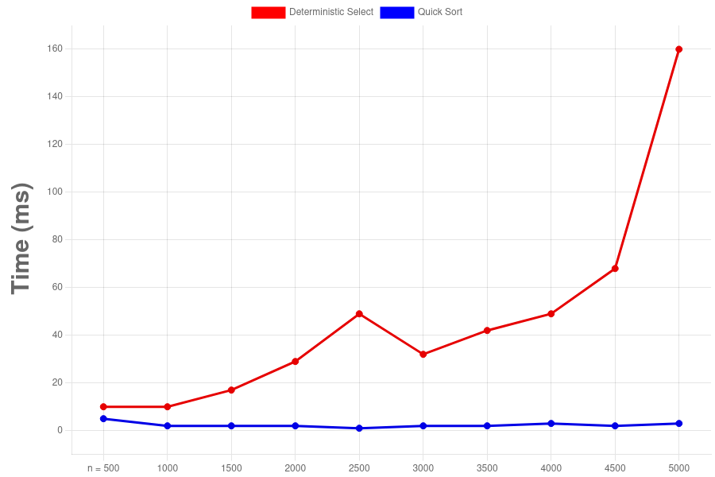

#  Assignment 1
_A description that contains complex analyze: what it is and why it is needed_


## 📑 Contents
- [_Architecture notes_](#1-architecture-notes)
- [_Recurrence Analyze_](#2-recurrence-analyze)
- [_Constant-Factor Effects_](stant-factor-effects)
- [_Summary_](#summary)


## ⚙️ Clone the Repository
```
git clone https://github.com/Mansurrv/SerikbaiMansur_assignment1
```


## 🖼 Diagrams





## 🛠 Technology stack
- Java Core
- Python
- JUnit5
- Maven


# 1. Architecture notes

### 1.1 Quick Sort

**Recursion depth**   -   Controlled by optimizing tail of recursion on the larger partition. Shortly the recursive call is always directed to the smaller of the tw partitions, and the larger partition is processed in an iterative while loop.

**Supporting element**   -   A randomized anchor element that is selected from a random index in the range from low to high is used, which provides the expected complexity of `O(n logn)` and guarantees that the worst case of `O(n^2)` is extremely unlikely

**Limit**   -   This architecture limits the recursion depth to `O(logn)`, preventing stack overflow even on very large, already sorted, or reverse sorted arrays

### 1.2 Closest Pair of Points

**Memory management**   -   The main memory management occurs when creating strip list at each step of recursion. Unlike in-place sorting, here O(n) memory is allocated for the strip, although this amount decreases at each level of recursion

**Complexity**   -   The complexity of `O(n logn)` is achieved through two keys points:
* Sorting by X is performed once before recursion `O(n log n)`
* Sorting the Strip by Y at each level of recursion, combined with linear processing `O(n)`, maintains the overall complexity of `O(n log n)`

### 1.3 Deterministic Select

**Memory management**   -   The algorithm performs most operations in-place. The only memory allocation accurs for the array of medians m that size is `n/5`.

**Recursion Control**   -   Achieves linear complexity `O(n)` by selecting a deterministic pivot that is quaranteed to be in the range between 30% and 70% of the elements. This prevents the "BAD" partitions characteristic of **QuickSelect**.

<br>
<br>

# 2. Recurrence Analyze

### 2.1 Merge Sort

The method of analysis that i use is _Master Theorem_. The Recursive Ratio is `T(n) = 2*T*(n/2) + Θ(n)` it is `T(n) = O(n logn)`.

#### Explanation how i find it?

- `a=2` two recursive calls
- `b=2` size of subtask `## 👨‍💻 Автор
- Mansur Serikbai (@mansurrvv)n/2`
- `f(n)=n` merger cost

### 2.2 Quick Sort

The method of analysis that i use is _Average-Case Analysis_. The Recursive Ratio is `E(T(n)) ≈ 2*E*(T(n)) + Θ(n)`. Since, on average, the pivot element divides the array roughly in half, the expected recurrence corresponds to the recurrence of MergeSort. Result is `Θ(nlogn)`.

### 2.3 Closest Pair of Points

The method of analysis that i use is _Master Theorem_. The Recusive Ratio is `T(n) = 2*T*(n/2) + Θ(n)`.

#### Explanation how i find it?

- `a=2` two recursive calls
- `b=2` size of subtask _n/2_
- `f(n)=n` cost of linear passage along a strip

### 2.4 Deterministic Select (Median of Medians)

The method of analysis that i use is _Substitution Method_ or _Akra-Bazzi_. The Recursive Ratio `T(n) <= T(n/5) + T(7n/10) + Θ(n)`. 

#### Explanation how i find it?

- `T(n/5)` this is recursive calls for determine Median of Medians
- `T(7n/10)` this is worst case for recursive call on a subarray. That means after splitting, one side has no more than `7n/10` elements.

#### Akra-Bazzi: 

- The sum of recursion shares is `1/5 + 7/10 = 2/10 + 7/10 = 9/10` the cost of recursive calls grows slower than linear work `Θ(n)`.

#### The result will be:

-  `Θ(n)`

<br>
<br>

# 3 Constant-Factor Effects

### 3.1 Cache Locality 

#### 3.1.1 Merge Sort

- My Merge Sort algorithm has poor cache locality because it constantly works with a buffer and has to jump between the source array and the buffer during the merge operation. This leads to more cache misses and a higher constant factor.

#### 3.1.2 Quick Sort

- My quickSort algorithm has good cache locality. Partition operations work sequentially on adjacent array elements, which maximizes the use of data already loaded into the cache.

### 3.2 Impact of overhead costs

#### 3.2.1 Deterministic Select 

- My Deterministic Select algorithm that uses Median of Medians has very high constant factor. Constant division into groups of 5, multiple Insertion Sort for small groups, and two recursive calls even if they are quaranteed its make this algorithm slower in practice than the usual Quick Select or Quick Sort, despite its excellent theoretical complexity of `O(n)`.

#### 3.2.2 Closest Pair algorithm Pair - of - Points

- Numerious operations with floating point numbers, memory allocation for ArrayList, and the use of Comparator for sorting the band introduce significant overhead, increasing the constant factor compared to integer sorting.

### 3.3 Garbage Collection

#### 3.3.1 Closest Pair 

- In my Closest Pair algorithm using `List<Point>` and creating a new `ArrayList(strip)` at each level of recursion leads to intensive object allocation. This increases the load on the garbage collector, which can cause periodic delays in execution.

#### 3.3.2 Merge Sort

- In my Merge Sort algorithm work primarily with primitive `int[] array` and have minimal impact on garbage collection.

#### 3.3.3 Quick Sort / Select

- In my Quick Sort / Select algorithms work primarily with primitive `int[] array` and have minimal impact on Garbage Collection (GC).


# Summary

### Algorithm:

#### 1. Merge Sort

- Theory Θ: `Θ(n logn)` 
- Practical observation: Average performance, high overhead due to buffer handling.
- Allignment / Misallignment: Compliance

#### 2. Quick Sort

- Theory A complex description: what it is and why it is needed Θ: `Θ(n logn)`
- Practical observation: High performance thanks to in-place partitioning and good cache locality.
- Allignment / Misallignment: Compliance

#### 3. Closest Pair

- Theory Θ: `Θ(n logn)`
- Practical observation: The practical speed in slower due to the high cost of double operations and Garbage Collection overhead.
- Allignment / Misallignment: Compliance in order of GROWTH

#### 4. Deterministic Select

- Theory Θ: `Θ(n)`
- Practical observation: The highest constant factor. In practice, slower than _O(n logn)_ Quick Sort / Select for most n.
- Allignment / Misallignment: Compliance slower in practice


## 👨‍💻 Developer
- Mansur Serikbai (@mansurrvv)
